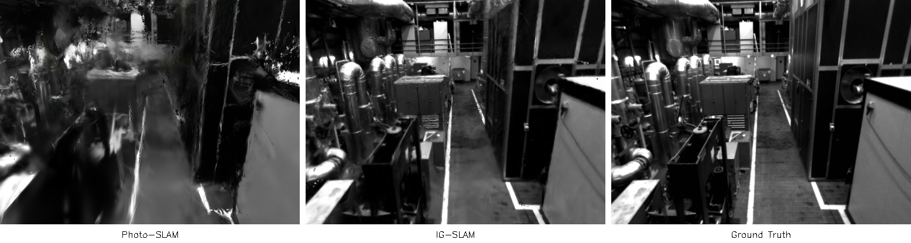
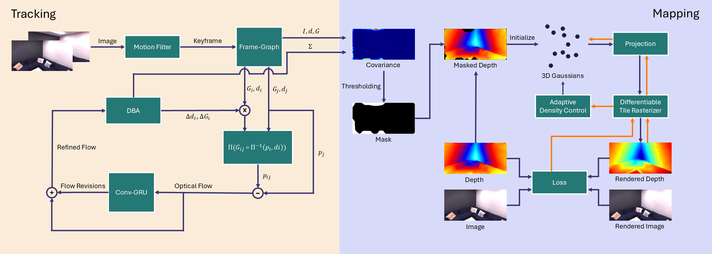
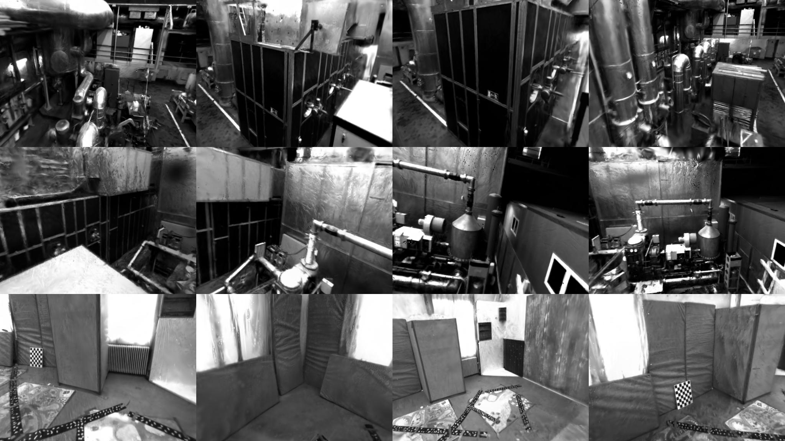

<h1 align="center"> IG-SLAM <br>Instant Gaussian SLAM <br> (Presented at ECCV'24 NeuSLAM Workshop) </h1> 


This repository contains the code and trained models of our work  "**IG-SLAM: Instant Gaussian SLAM**",  [ECCV'24 NeuSLAM](https://sites.google.com/view/neuslam)

by Furkan Aykut Sarıkamış, A. Aydın Alatan

Department of Electrical and Electronics Engineering,
Middle East Technical University


<div class="alert alert-info">

<h2 align="center"> 

[Paper & Supplementary](https://arxiv.org/abs/2408.01126/) 
</h2>


<p align="center">
  
</p>


## Abstract
<div style="text-align: justify;">
3D Gaussian Splatting has recently shown promising results as an alternative scene representation in SLAM systems to neural implicit representations. However, current methods either lack dense depth maps to supervise the mapping process or detailed training designs that consider the scale of the environment. To address these drawbacks, we present IG-SLAM, a dense RGB-only SLAM system that employs robust dense SLAM methods for tracking and combines them with Gaussian Splatting. A 3D map of the environment is constructed using accurate pose and dense depth provided by tracking. Additionally, we utilize depth uncertainty in map optimization to improve 3D reconstruction. Our decay strategy in map optimization enhances convergence and allows the system to run at 10 fps in a single process. We demonstrate competitive performance with state-of-the-art RGB-only SLAM systems while achieving faster operation speeds. We present our experiments on the Replica, TUM-RGBD, ScanNet, and EuRoC datasets. The system achieves photo-realistic 3D reconstruction in large-scale sequences, particularly in the EuRoC dataset. 
</div>

**Contributions:** 

* We present **IG-SLAM**, an efficient dense RGB SLAM system that performs at high frame rates, offering scalability and robustness even in challenging conditions.

* A novel 3D reconstruction algorithm that accounts for **depth uncertainty**, making the 3D reconstruction robust to noise.

* A training procedure to make **dense depth supervision** for the mapping process as efficient as possible. 


**System Overview** 

IG-SLAM consists of two main parts: **tracking**  and **mapping**.

<p align="center">

</p>


Please cite as:

```bibtex
@article{sarikamis2024ig,
  title={Ig-slam: Instant gaussian slam},
  author={Sarikamis, F Aykut and Alatan, A Aydin},
  journal={arXiv preprint arXiv:2408.01126},
  year={2024}
}
```

## Code

You may need to install GLM library.

```bash
sudo apt-get install libglm-dev
```

You can create an anaconda environment called `igslam`.

```bash

git clone --recursive https://github.com/Liouvi/IG-SLAM.git
    
conda env create -f environment.yml
conda activate igslam
python setup.py install

```


**You may need to close visualization to improve reconstruction results**

For example:

configs/Replica/replica_mono.yaml


```
inherit_from: configs/Replica/base_config.yaml

verbose: False
dataset: 'replica'
mode: mono
stride: 1
only_tracking: False
vis: False
```

Set vis variable as intended.

### Replica

```bash

bash scripts/download_replica.sh

python run.py --config configs/Replica/office0_mono.yaml

```


### TUM

```bash

bash scripts/download_tum.sh

python run.py --config configs/tum/fr1_desk.yaml

```

### ScanNet
Please follow the data downloading procedure on [ScanNet](http://www.scan-net.org/) website, and extract color/depth frames from the `.sens` file using this [code](https://github.com/ScanNet/ScanNet/blob/master/SensReader/python/reader.py).

```
  datasets
  └── ScanNet
      └── scans
          └── scene0000_00
              └── frames
                  ├── color
                  │   ├── 0.jpg
                  │   ├── 1.jpg
                  │   ├── ...
                  │   └── ...
                  ├── depth
                  │   ├── 0.png
                  │   ├── 1.png
                  │   ├── ...
                  │   └── ...
                  ├── intrinsic
                  └── pose
                      ├── 0.txt
                      ├── 1.txt
                      ├── ...
                      └── ...

```

Once the data is set up properly, you can run:

```bash
python run.py --config configs/ScanNet/scene0000_mono.yaml
```

### EuRoC

```bash

bash scripts/download_euroc.sh
```

The GT trajectory can be downloaded from GO-SLAM's Drive [Google Drive](https://drive.google.com/drive/folders/1RJr38jvmuIV717PCEcBkzV2qkqUua-Fx?usp=sharing).

```
  DATAROOT
  └── EuRoC
     └── MH_01_easy
         └── mav0
             ├── cam0
             ├── cam1
             ├── imu0
             ├── leica0
             ├── state_groundtruth_estimate0
             └── body.yaml
         └── MH_01_easy.txt

```
</details>

Then you can run:

```bash
python run.py --config configs/EuRoC/mh_01_easy.yaml
```

## Qualitative Results

<p align="center">

</p>

## Contacts

For questions, please send an email to aykut.sarikamis@metu.edu.tr


## Acknowledgements

This project would not be possible without excellent works including [GO-SLAM](https://github.com/youmi-zym/GO-SLAM), [NeRF-SLAM](https://github.com/ToniRV/NeRF-SLAM), [MonoGS](https://github.com/muskie82/MonoGS), and [DROID-SLAM](https://github.com/princeton-vl/DROID-SLAM).